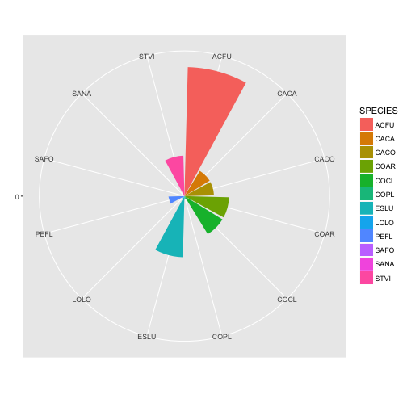

# Beta diversity in space and time  
### QCBS R symposium 2018  
### Vincent Fugere & Katrine Turgeon  
  
Cleaning up


```r
rm(list=ls())
```

Loading data for temporal diversity example (it takes some time)


```r
library(adklakedata)
zoops <- adk_data('crustacean')
pH <- adk_data('chem')
```

## Example I: Ugandan streams (spatial beta div)


```r
library(RCurl)
library(vegan)
library(gclus)
library(RColorBrewer)
library(ade4)
library(adespatial)
```

getting the dataset from GitHub


```r
kib <-read.csv(text=getURL("https://raw.githubusercontent.com/VFugere/QCBS_betadiv/master/kibale_inverts.csv"), header=T)
```

Alternative: getting the dataset from the Open Science Framework (OSF) website


```r
# devtools::install_github('chartgerink/osfr')
# library(osfr)
# osfr::download_files('zc6xt', '/Users/vincentfugere/Desktop/') #change path to working directory
# kib <- read.csv('/Users/vincentfugere/Desktop/kibale_inverts.csv', header=T)
```

If both fail, you can always try Dropbrox! (link might become obsolete eventually)


```r
# https://www.dropbox.com/s/qj8vswqp322add2/kibale_inverts.csv?dl=0
```

fixing some issues


```r
colnames(kib)[1] <- 'site.code' #corrects excel generated junk
kib$land.use <- relevel(kib$land.use, 'park') #more intuitive to have park/forest as reference level
```

have a look at the data


```r
head(kib)
str(kib)
```

will model community composition (columns aeshnidae:veliidae) ~ land.use  
some useful matrices


```r
spe <- kib[,-c(1:3)]
row.names(spe) <- kib$site.code
site <- kib[,2:3]
rownames(site) <- kib[,1]
```

### 'Classic' community composition & alpha diversity analysis  
Dissimilarity matrix (log to give more weight to rare species).  
Chose Bray-Curtis but could use something else


```r
spe.dis <- vegdist(log1p(spe), method='bray')
```

Do land use categories differ in community composition?  
Clustering of sites using dissimilarity matrix & UPGMA clustering


```r
spe.dis.UPGMA <- hclust(spe.dis, method="average")
spe.dis.o <- reorder.hclust(spe.dis.UPGMA, spe.dis)
dend <- as.dendrogram(spe.dis.o)
com.tx <- apply(t(spe),1,sum) #common taxa for heat map plot
spe.com <- spe[,which(com.tx > 20)]
or <- vegemite(spe.com, spe.dis.o,scale='log')
```

```r
heatmap(t(spe.com[or$species]), Rowv=NA, Colv=dend, cexRow=0.5, cexCol=0.5, col=c('white', brewer.pal(5,"Greens")), scale="column", revC = T, margin=c(4.5,8))
```


farm sites (Kab & Kam) are very different from forest sites (For)  
  
Confirm overall difference with permutational multivariate analysis of variance


```r
adonis(spe.dis ~ land.use, data=site, permutations=1000)
```

```
## 
## Call:
## adonis(formula = spe.dis ~ land.use, data = site, permutations = 1000) 
## 
## Permutation: free
## Number of permutations: 1000
## 
## Terms added sequentially (first to last)
## 
##           Df SumsOfSqs MeanSqs F.Model      R2   Pr(>F)    
## land.use   1    2.0607 2.06071  15.649 0.32842 0.000999 ***
## Residuals 32    4.2139 0.13168         0.67158             
## Total     33    6.2746                 1.00000             
## ---
## Signif. codes:  0 '***' 0.001 '**' 0.01 '*' 0.05 '.' 0.1 ' ' 1
```

Do land use categories differ in alpha diversity?


```r
div <- site[,1:2]
div$abund <- apply(spe,MARGIN=1,FUN=sum)
div$richness <- specnumber(spe)
div$r.richness <- rarefy(spe,min(div$abund)) #uses 77 random individuals, the lowest abundance among samples
div$shannon <- diversity(spe, index='shannon')
```

```r
par(mfrow=c(2,2), mar=c(4,4,1,1), cex=1)
boxplot(richness ~ land.use, div, ylab="richness",whisklty=1,boxwex=0.5,staplelwd=-1)
boxplot(r.richness ~ land.use, div, ylab="rarefied richness",whisklty=1,boxwex=0.5,staplelwd=-1)
boxplot(shannon ~ land.use, div, ylab=expression("Shannon-Wiener "*italic("H")),whisklty=1,boxwex=0.5,staplelwd=-1)
plot(specaccum(spe), xlab = "streams sampled", ylab = "taxa sampled",ci.type='polygon',ci.col='light gray',ci.lty=0,lwd=2)
plot(specaccum(spe[which(div$land.use == 'park'),]),add=TRUE,ci=0,lwd=2,col='red')
plot(specaccum(spe[which(div$land.use == 'farm'),]),add=TRUE,ci=0,lwd=2,col='blue')
points(x=c(34,11,23),y=c(57,44,48),pch=16,col=c(1,2,4),cex=1.2)
legend('bottom',legend=c('park','farm','both'),bty='n',pt.cex=1.2,pch=16,col=c('red','blue','black'))
```


```r
par(mfrow=c(1,1))
```

### Beta diversity, at last


```r
beta.BC <- betadisper(spe.dis, site$land.use, type = 'centroid')
plot(beta.BC) #ugly
```


```r
mybetadivplot <- function (x, cex=1){
  g <- scores(x, choices = 1:2)
  plot(g$sites, type = "n", ylab='Dimension 2', xlab='Dimension 1')
  points(g$sites, pch = c(21,22,21)[site$region], bg=c('white','white','black')[site$region])
  points(g$centroids, pch = 16, cex = 1.5, col = "red")
  for (i in levels(x$group)) {
    ch <- chull(g$sites[x$group == i, ])
    ch <- c(ch, ch[1])
    lines(x$vectors[x$group == i, 1:2][ch, ], col = "black", lty = "dashed")
  }
  legend('topright',cex=1, pt.cex=1, inset = c(0.2,0),legend=c("Kab (farm)","Kam (farm)",'For (park)'),pch=c(21,22,21),pt.bg=c('white','white','black'),bty='n')
}
mybetadivplot(beta.BC)
legend('bottomright',bty='n',inset=c(0.2,0),legend = expression(italic(Bray-Curtis)))
```


With incidence-based index instead


```r
dist.jac <- vegdist(spe, method='jaccard', binary=T)
beta.jac <- betadisper(dist.jac, site$land.use, type='centroid')
mybetadivplot(beta.jac)
legend('bottomright',bty='n',inset=c(0.2,0),legend = expression(italic(Jaccard)))
```


significant difference?


```r
permutest(beta.jac)
```

```
## 
## Permutation test for homogeneity of multivariate dispersions
## Permutation: free
## Number of permutations: 999
## 
## Response: Distances
##           Df  Sum Sq  Mean Sq      F N.Perm Pr(>F)    
## Groups     1 0.16536 0.165361 32.538    999  0.001 ***
## Residuals 32 0.16263 0.005082                         
## ---
## Signif. codes:  0 '***' 0.001 '**' 0.01 '*' 0.05 '.' 0.1 ' ' 1
```

```r
boxplot(beta.jac$distances ~ site$land.use, ylab="Distance to centroid",whisklty=1,boxwex=0.5,staplelwd=-1,frame.plot=F,xaxt='n',ylim=c(.2,.7))
axis(1,at=c(1,2),labels=c('park','farm'),tick=F)
```


decompose D into richness difference + replacement difference


```r
park.jac <- beta.div.comp(spe[site$land.use == 'park',],coef='J',quant=F)
farm.jac <- beta.div.comp(spe[site$land.use == 'farm',],coef='J',quant=F)
park.jac
```

```
## $repl
##             For1       For2       For3       For4       For5       For6
## For2  0.24242424                                                       
## For3  0.43750000 0.29411765                                            
## For4  0.51612903 0.24242424 0.33333333                                 
## For5  0.30769231 0.18750000 0.21428571 0.35714286                      
## For6  0.37037037 0.18750000 0.14814815 0.29629630 0.40000000           
## For7  0.62500000 0.34285714 0.48484848 0.51612903 0.51851852 0.62068966
## For8  0.37037037 0.24242424 0.33333333 0.41379310 0.26086957 0.46153846
## For9  0.42857143 0.18750000 0.14814815 0.35714286 0.40000000 0.18181818
## For10 0.41176471 0.38888889 0.41176471 0.41176471 0.20000000 0.31250000
## For11 0.24000000 0.06666667 0.27586207 0.23076923 0.26086957 0.40000000
##             For7       For8       For9      For10
## For2                                             
## For3                                             
## For4                                             
## For5                                             
## For6                                             
## For7                                             
## For8  0.46153846                                 
## For9  0.62068966 0.46153846                      
## For10 0.20000000 0.20000000 0.31250000           
## For11 0.51851852 0.40000000 0.40000000 0.25806452
## 
## $rich
##             For1       For2       For3       For4       For5       For6
## For2  0.21212121                                                       
## For3  0.09375000 0.11764706                                            
## For4  0.03225806 0.18181818 0.06666667                                 
## For5  0.07692308 0.28125000 0.17857143 0.10714286                      
## For6  0.07407407 0.28125000 0.18518519 0.11111111 0.00000000           
## For7  0.06250000 0.25714286 0.15151515 0.09677419 0.00000000 0.00000000
## For8  0.07407407 0.27272727 0.16666667 0.10344828 0.00000000 0.00000000
## For9  0.07142857 0.28125000 0.18518519 0.10714286 0.00000000 0.00000000
## For10 0.14705882 0.05555556 0.05882353 0.11764706 0.23333333 0.21875000
## For11 0.12000000 0.33333333 0.20689655 0.15384615 0.04347826 0.04000000
##             For7       For8       For9      For10
## For2                                             
## For3                                             
## For4                                             
## For5                                             
## For6                                             
## For7                                             
## For8  0.00000000                                 
## For9  0.00000000 0.00000000                      
## For10 0.23333333 0.23333333 0.21875000           
## For11 0.03703704 0.04000000 0.04000000 0.25806452
## 
## $D
##            For1      For2      For3      For4      For5      For6
## For2  0.4545455                                                  
## For3  0.5312500 0.4117647                                        
## For4  0.5483871 0.4242424 0.4000000                              
## For5  0.3846154 0.4687500 0.3928571 0.4642857                    
## For6  0.4444444 0.4687500 0.3333333 0.4074074 0.4000000          
## For7  0.6875000 0.6000000 0.6363636 0.6129032 0.5185185 0.6206897
## For8  0.4444444 0.5151515 0.5000000 0.5172414 0.2608696 0.4615385
## For9  0.5000000 0.4687500 0.3333333 0.4642857 0.4000000 0.1818182
## For10 0.5588235 0.4444444 0.4705882 0.5294118 0.4333333 0.5312500
## For11 0.3600000 0.4000000 0.4827586 0.3846154 0.3043478 0.4400000
##            For7      For8      For9     For10
## For2                                         
## For3                                         
## For4                                         
## For5                                         
## For6                                         
## For7                                         
## For8  0.4615385                              
## For9  0.6206897 0.4615385                    
## For10 0.4333333 0.4333333 0.5312500          
## For11 0.5555556 0.4400000 0.4400000 0.5161290
## 
## $part
##         BDtotal            Repl         RichDif    Repl/BDtotal 
##       0.2317362       0.1715647       0.0601715       0.7403448 
## RichDif/BDtotal 
##       0.2596552 
## 
## $Note
## [1] "Podani family, Jaccard"
```

```r
BD.mat <- cbind(park.jac$part[2:3],farm.jac$part[2:3],park.jac$part[4:5],farm.jac$part[4:5])
barplot(BD.mat, names.arg=rep(c('park','farm'),2), col=c(4,2), width=0.5, ylab='contribution to total dissimilarity')
axis(1, lwd=0, lwd.ticks=0, at=c(0.66,1.85), labels = c('absolute','relative'), line = 2, cex = 1.5)
legend('topleft', inset=c(0.1,0), legend=c(expression(paste(Delta,' richness',sep='')),'replacement'), pch=22, pt.bg=c(2,4), bty='n', y.intersp = 2)
```


```r
par(mfrow=c(1,2))
triang1 = cbind(park.jac$rich,(1-park.jac$D), park.jac$repl)
triangle.plot(as.data.frame(triang1), show=F, addmean=T, labeltriangle=F, scale=F)
triang2 = cbind(farm.jac$rich,(1-farm.jac$D), farm.jac$repl)
triangle.plot(as.data.frame(triang2), show=F, labeltriangle=F, addmean = T, scale=F)
```


## Example II: Adirondack lakes (temporal beta div)


```r
library(dplyr)
library(tidyr)
library(magrittr)
library(ggplot2)
```

getting TBI() function. I DL'd it from Pierre's site and UL'd to GitHub (it might be in a package too)


```r
TBIfunc <- getURL("https://raw.githubusercontent.com/VFugere/QCBS_betadiv/master/TBI.R", ssl.verifypeer = FALSE)
eval(parse(text = TBIfunc))
```

loading and formatting dataset. Large-ish dataset so moving to the tidyverse


```r
zoops$Sp <- paste0(zoops$Genus,'.',zoops$Species) %>% as.factor
zoops %<>% select(-PERMANENT_ID, -date, -(month:ug_WWperind), -mgWW.l) %>%
  group_by(lake.name, year, Sp) %>%
  summarize(density = mean(org.l)) %>%
  spread(Sp, density) 
```

only 50% of lakes have data up to 2012. Others stop at 2006


```r
with(zoops, table(lake.name, year))
```

```
##                    year
## lake.name           1994 1995 1996 1997 1998 1999 2000 2001 2002 2003 2004
##   Big Moose            1    1    1    1    1    1    1    1    1    1    1
##   Brooktrout           1    1    1    1    1    1    1    1    1    1    1
##   Carry                1    1    1    1    1    1    1    1    1    1    1
##   Cascade              1    1    1    1    1    1    1    1    1    1    1
##   Constable            1    1    1    1    1    1    1    1    1    1    1
##   Dart                 1    1    1    1    1    1    1    1    1    1    1
##   G                    1    1    1    1    1    1    1    1    1    1    1
##   Grass                1    1    1    1    1    1    1    1    1    1    1
##   Indian               1    1    1    1    1    1    1    1    1    1    1
##   Jockeybush           1    1    1    1    1    1    1    1    1    1    1
##   Limekiln             1    1    1    1    1    1    1    1    1    1    1
##   Long                 1    1    1    1    1    1    1    1    1    1    1
##   Loon Hollow          1    1    1    1    1    1    1    1    1    1    1
##   Middle Branch        1    1    1    1    1    1    1    1    1    1    1
##   Middle Settlement    1    1    1    1    1    1    1    1    1    1    1
##   Moss                 1    1    1    1    1    1    1    1    1    1    1
##   North                1    1    1    1    1    1    1    1    1    1    1
##   Queer                1    1    1    1    1    1    1    1    1    1    1
##   Raquette             1    1    1    0    1    1    1    1    1    1    1
##   Rondaxe              1    1    1    1    1    1    1    1    1    1    1
##   Sagamore             1    1    1    1    1    1    1    1    1    1    1
##   South                1    1    1    1    1    1    1    1    1    1    1
##   Squash               1    1    1    1    1    1    1    1    1    1    1
##   Squaw                1    1    1    1    1    1    1    1    1    1    1
##   West                 1    1    1    1    1    1    1    1    1    1    1
##   Willis               1    1    1    1    1    1    1    1    1    1    1
##   Willys               1    1    1    1    1    1    1    1    1    1    1
##   Windfall             1    1    1    1    1    1    1    1    1    1    1
##                    year
## lake.name           2005 2006 2007 2008 2010 2011 2012
##   Big Moose            1    1    1    1    1    1    1
##   Brooktrout           1    1    1    1    1    1    1
##   Carry                1    1    0    0    0    0    0
##   Cascade              1    1    1    1    1    1    1
##   Constable            1    1    0    0    0    0    0
##   Dart                 1    1    1    1    1    1    1
##   G                    1    1    1    1    1    1    1
##   Grass                1    1    0    0    0    0    0
##   Indian               1    1    1    1    1    1    1
##   Jockeybush           1    1    1    1    1    1    1
##   Limekiln             1    1    1    1    1    1    1
##   Long                 1    1    0    0    0    0    0
##   Loon Hollow          1    1    0    0    0    0    0
##   Middle Branch        1    1    0    0    0    0    0
##   Middle Settlement    1    1    1    1    0    0    0
##   Moss                 1    1    1    1    1    1    1
##   North                1    1    1    1    1    1    1
##   Queer                1    1    0    0    0    0    0
##   Raquette             1    1    0    0    0    0    0
##   Rondaxe              1    1    1    1    1    1    1
##   Sagamore             1    1    1    1    1    1    1
##   South                1    1    1    1    1    1    1
##   Squash               1    1    0    0    0    0    0
##   Squaw                1    1    1    1    1    1    1
##   West                 1    1    0    0    0    0    0
##   Willis               1    1    0    0    0    0    0
##   Willys               1    1    0    0    0    0    0
##   Windfall             1    1    0    0    0    0    0
```

```r
table <- with(zoops, table(lake.name, year))
names(table[table[,18] == 1,18]) -> lakes2kp
zoops %<>% filter(lake.name %in% lakes2kp)
```

adding pH


```r
pH %<>% select(lake.name, year, pH) %>%
  group_by(lake.name, year) %>%
  summarize(pH = mean(pH))
zoops <- left_join(zoops, pH, by = c('lake.name','year')) %>%
  select(lake.name, year, pH, everything()) %>%
  as.data.frame
```

#### Pierre Legendres's TBI function  
  
1) subsetting data to use oldest and most recent time points


```r
com.y1 <- zoops %>% filter(year == 1994) %>% select(Aglaodiaptomus.leptpus:unknown.unknown) %>% as.matrix
com.y2 <- zoops %>% filter(year == 2012) %>% select(Aglaodiaptomus.leptpus:unknown.unknown) %>% as.matrix
```

2) setting up a results matrix and adding pH change as an explanatory variable


```r
TBI.mat <- zoops %>% filter(year == 2012) %>% select(lake.name:pH) %>% as.data.frame
TBI.mat$ph.t1 <- zoops$pH[zoops$year == 1994]
TBI.mat$ph.diff <- zoops$pH[zoops$year == 2012] - zoops$pH[zoops$year == 1994]
```

3) computing dissimilarity in time and partitioning into constituents


```r
TBI.res <- TBI(com.y1, com.y2, method="jaccard", pa.tr=T, save.BC = T)
TBI.res$TBI #these are Jaccard dissimilarities among the 2 sampling occasions for each site
```

```
##  [1] 0.5000000 0.5714286 0.8181818 0.6363636 0.2857143 0.5000000 0.5454545
##  [8] 0.5000000 0.5000000 0.1428571 0.2727273 0.2857143 0.4285714 0.2000000
```

```r
TBI.res$BC #number of taxa lost (B) and gained (C) over study period
```

```
##         B C
## Site.1  2 3
## Site.2  1 3
## Site.3  5 4
## Site.4  2 5
## Site.5  1 1
## Site.6  4 0
## Site.7  2 4
## Site.8  2 3
## Site.9  4 2
## Site.10 1 0
## Site.11 0 3
## Site.12 1 1
## Site.13 1 2
## Site.14 1 1
```

```r
TBI.res$BCD.mat #relative contributions of gains and losses to TBI
```

```
##         B/(A+B+C) C/(A+B+C) D=(B+C)/(A+B+C) Change
## Site.1  0.2000000 0.3000000       0.5000000    +  
## Site.2  0.1428571 0.4285714       0.5714286    +  
## Site.3  0.4545455 0.3636364       0.8181818    –  
## Site.4  0.1818182 0.4545455       0.6363636    +  
## Site.5  0.1428571 0.1428571       0.2857143    +  
## Site.6  0.5000000 0.0000000       0.5000000    –  
## Site.7  0.1818182 0.3636364       0.5454545    +  
## Site.8  0.2000000 0.3000000       0.5000000    +  
## Site.9  0.3333333 0.1666667       0.5000000    –  
## Site.10 0.1428571 0.0000000       0.1428571    –  
## Site.11 0.0000000 0.2727273       0.2727273    +  
## Site.12 0.1428571 0.1428571       0.2857143    +  
## Site.13 0.1428571 0.2857143       0.4285714    +  
## Site.14 0.1000000 0.1000000       0.2000000    +
```

4) adding results to dataframe and plotting beta div ~ pH and pH change


```r
TBI.mat <- cbind(TBI.mat, TBI.res$TBI, TBI.res$BC, TBI.res$BCD.mat[,1:2]) %>% as.data.frame
TBI.mat %<>% rename('TBI' = `TBI.res$TBI`, 'loss' = B, 'gain' = C)
colnames(TBI.mat)[9:10] <- c('rel.loss','rel.gain')
```

```r
cols <- brewer.pal(5,'Dark2')
par(mfrow=c(3,5),mar=c(4,4,0,0),cex=1)
plot(TBI ~ ph.t1, TBI.mat, xlab='initial pH', pch=17, col=alpha(cols[1],0.5),bty='l')
plot(loss ~ ph.t1, TBI.mat, xlab='initial pH', pch=17, col=alpha(cols[2],0.5),bty='l')
plot(gain ~ ph.t1, TBI.mat, xlab='initial pH', pch=17, col=alpha(cols[3],0.5),bty='l')
plot(rel.loss ~ ph.t1, TBI.mat, xlab='initial pH', pch=17, col=alpha(cols[4],0.5),bty='l')
plot(rel.gain ~ ph.t1, TBI.mat, xlab='initial pH', pch=17, col=alpha(cols[5],0.5),bty='l')
plot(TBI ~ pH, TBI.mat, xlab='final pH', pch=16, col=alpha(cols[1],0.5),bty='l')
plot(loss ~ pH, TBI.mat, xlab='final pH', pch=16, col=alpha(cols[2],0.5),bty='l')
plot(gain ~ pH, TBI.mat, xlab='final pH', pch=16, col=alpha(cols[3],0.5),bty='l')
plot(rel.loss ~ pH, TBI.mat, xlab='final pH', pch=16, col=alpha(cols[4],0.5),bty='l')
plot(rel.gain ~ pH, TBI.mat, xlab='final pH', pch=16, col=alpha(cols[5],0.5),bty='l')
plot(TBI ~ ph.diff, TBI.mat, pch=15, col=alpha(cols[1],0.5),bty='l')
plot(loss ~ ph.diff, TBI.mat, pch=15, col=alpha(cols[2],0.5),bty='l')
plot(gain ~ ph.diff, TBI.mat, pch=15, col=alpha(cols[3],0.5),bty='l')
plot(rel.loss ~ ph.diff, TBI.mat, pch=15, col=alpha(cols[4],0.5),bty='l')
plot(rel.gain ~ ph.diff, TBI.mat, pch=15, col=alpha(cols[5],0.5),bty='l')
```


5) repeating the whole thing with %diff (Bray-Curtis) instead of p/a


```r
TBI.mat <- zoops %>% filter(year == 2012) %>% select(lake.name:pH) %>% as.data.frame
TBI.mat$ph.t1 <- zoops$pH[zoops$year == 1994]
TBI.mat$ph.diff <- zoops$pH[zoops$year == 2012] - zoops$pH[zoops$year == 1994]
### THIS IS THE ONLY LINE THAT CHANGES ###
TBI.res <- TBI(com.y1, com.y2, method="ruzicka", pa.tr=F, save.BC = T)
### THIS IS THE ONLY LINE THAT CHANGES ###
TBI.mat <- cbind(TBI.mat, TBI.res$TBI, TBI.res$BC, TBI.res$BCD.mat[,1:2]) %>% as.data.frame
TBI.mat %<>% rename('TBI' = `TBI.res$TBI`, 'loss' = B, 'gain' = C)
colnames(TBI.mat)[9:10] <- c('rel.loss','rel.gain')
par(mfrow=c(3,5),mar=c(4,4,0,0),cex=1)
plot(TBI ~ ph.t1, TBI.mat, xlab='initial pH', pch=17, col=alpha(cols[1],0.5),bty='l')
plot(loss ~ ph.t1, TBI.mat, xlab='initial pH', pch=17, col=alpha(cols[2],0.5),bty='l')
plot(gain ~ ph.t1, TBI.mat, xlab='initial pH', pch=17, col=alpha(cols[3],0.5),bty='l')
plot(rel.loss ~ ph.t1, TBI.mat, xlab='initial pH', pch=17, col=alpha(cols[4],0.5),bty='l')
plot(rel.gain ~ ph.t1, TBI.mat, xlab='initial pH', pch=17, col=alpha(cols[5],0.5),bty='l')
plot(TBI ~ pH, TBI.mat, xlab='final pH', pch=16, col=alpha(cols[1],0.5),bty='l')
plot(loss ~ pH, TBI.mat, xlab='final pH', pch=16, col=alpha(cols[2],0.5),bty='l')
plot(gain ~ pH, TBI.mat, xlab='final pH', pch=16, col=alpha(cols[3],0.5),bty='l')
plot(rel.loss ~ pH, TBI.mat, xlab='final pH', pch=16, col=alpha(cols[4],0.5),bty='l')
plot(rel.gain ~ pH, TBI.mat, xlab='final pH', pch=16, col=alpha(cols[5],0.5),bty='l')
plot(TBI ~ ph.diff, TBI.mat, pch=15, col=alpha(cols[1],0.5),bty='l')
plot(loss ~ ph.diff, TBI.mat, pch=15, col=alpha(cols[2],0.5),bty='l')
plot(gain ~ ph.diff, TBI.mat, pch=15, col=alpha(cols[3],0.5),bty='l')
plot(rel.loss ~ ph.diff, TBI.mat, pch=15, col=alpha(cols[4],0.5),bty='l')
plot(rel.gain ~ ph.diff, TBI.mat, pch=15, col=alpha(cols[5],0.5),bty='l')
```


## Example III: Quebec hydropower reservoirs  
#### Visualizing beta div & identifying important contributors


```r
library(tibble)
```

loading the dataset (emailed to you)  
**PLEASE DELETE FILE AFTER WORKSHOP!!!** UNPUBLISHED DATASET (BUT WILL BE ON FIGSHARE SOON)


```r
LG_Y <- read.csv('/Users/vincentfugere/Desktop/LG_Y.csv', header=T)
str(LG_Y)
```

```r
LG_Y_I<-LG_Y[LG_Y$I_R=="I",c(2,8:40)] # SUBSET OF IMPACTED STATIONS
LG_Y_R<-LG_Y[LG_Y$I_R=="R",c(2,8:40)] # SUBSET OF REFERENCE SITES
```

CREATING RAREFIED RICHNESS METRICS FOR IMPACTED STATIONS


```r
RRI<-specpool(LG_Y_I, smallsample=T, pool=LG_Y_I$TSI)
I_R <-c("I") # CREATING ONE VECTOR = IMPACTED 
RRI <-cbind(I_R, RRI) # MERGE THE RR METRICS AND THE VECTOR
rownames_to_column(RRI, var = "TSI")
RRI <- as_tibble(rownames_to_column(RRI, var = "TSI"))
```

CREATING RAREFIED RICHNESS FOR REFERENCE SITES


```r
RRR<-specpool(LG_Y_R, smallsample=T, pool=LG_Y_R$TSI)
I_R <-c("R")
RRR <-cbind(I_R, RRR)
rownames_to_column(RRR, var = "TSI")
RRR <- as_tibble(rownames_to_column(RRR, var = "TSI"))
```

```r
RR_IR<-bind_rows(list(RRI, RRR)) # combine both matrices
RR_IR$TSI<-as.integer(RR_IR$TSI)
```

LINEAR MODEL: RICHNESS IN RELATION TO TIME SINCE IMPOUNDMENT


```r
RR_CBIR <- lm(jack2 ~ TSI*I_R, weight=RR_IR$n, data=RR_IR)
summary(RR_CBIR)
```

```
## 
## Call:
## lm(formula = jack2 ~ TSI * I_R, data = RR_IR, weights = RR_IR$n)
## 
## Weighted Residuals:
##     Min      1Q  Median      3Q     Max 
## -18.362  -5.722  -1.876   3.683  26.090 
## 
## Coefficients:
##             Estimate Std. Error t value Pr(>|t|)    
## (Intercept) 20.07848    0.90868  22.096   <2e-16 ***
## TSI         -0.26520    0.11537  -2.299   0.0287 *  
## I_RR        -5.90095    2.62401  -2.249   0.0320 *  
## TSI:I_RR     0.09152    0.30021   0.305   0.7626    
## ---
## Signif. codes:  0 '***' 0.001 '**' 0.01 '*' 0.05 '.' 0.1 ' ' 1
## 
## Residual standard error: 9.103 on 30 degrees of freedom
## Multiple R-squared:  0.3227,	Adjusted R-squared:  0.2549 
## F-statistic: 4.764 on 3 and 30 DF,  p-value: 0.007829
```

GRAPH OF RICHNESS OVER TIME FOR IMPACTED AND REFERENCE SITES


```r
ggplot(RR_IR, aes(TSI, jack2, color=I_R, size = n)) + geom_point() + 
  geom_smooth(method = "lm", se= T) + 
  theme(panel.grid.major = element_blank(), panel.grid.minor = element_blank())
```


BETA DIVERSITY


```r
LG_com<-LG_Y[,-1:-7] #Keep only species columns

BDLG_dec<-beta.div.comp(LG_com)
BDLG_dec$part
```

```
##         BDtotal            Repl         RichDif    Repl/BDtotal 
##      0.24472347      0.14631212      0.09841136      0.59786712 
## RichDif/BDtotal 
##      0.40213288
```

```r
BDLG<-beta.div(LG_com,method="hellinger")
# ?beta.div
```

LCBD


```r
LGLCBD = data.frame(BDLG$LCBD, BDLG$p.LCBD)
LGLCBD <-cbind(LGLCBD, LG_Y)
LGLCBD$pval <- ifelse(LGLCBD$BDLG.p.LCBD >= 0.05, c("non-sig"), c("sig")) 

LGLCBD$REFUD<- factor(LGLCBD$REFUD, levels = c("UR", "UL", "D", "R"))

ggplot(LGLCBD, aes(TSI, STATION, color=REFUD, size =BDLG.LCBD, shape=pval)) + geom_point() + 
  scale_shape_manual(values=c(1, 19)) +
  scale_color_manual(values=c("firebrick3", "darkorange", "blue", "chartreuse4")) +
  theme(panel.grid.major = element_blank(), panel.grid.minor = element_blank())
```


SCBD


```r
LGSCBD = data.frame(BDLG$SCBD)
LGSCBD <- as_tibble(rownames_to_column(LGSCBD, var = "SPECIES"))
LGSCBD_s <- LGSCBD[c(1:3,5,9,11,13,15,16,17,20,22),] # Select the most abundant species
```

ROSE PLOT


```r
ggplot(LGSCBD_s, aes(x=SPECIES, y=BDLG.SCBD)) + geom_bar(aes(fill=SPECIES), stat="identity") +
  scale_y_continuous(breaks = 0:10) +
  coord_polar() + labs(x = "", y = "")
```


SUBSET for ROBERT-BOURASSA


```r
RB_Y<-LG_Y[LG_Y$RES=="RB",-1:-7] 
BDRB<-beta.div(RB_Y,method="hellinger")
RBSCBD = data.frame(BDRB$SCBD)
RBSCBD <- as_tibble(rownames_to_column(RBSCBD, var = "SPECIES"))
RBSCBD_s <- RBSCBD[c(1:3,5,9,11,13,15,16,17,20,22),]
ggplot(RBSCBD_s, aes(x=SPECIES, y=BDRB.SCBD)) + geom_bar(aes(fill=SPECIES), stat="identity") +
  scale_y_continuous(breaks = 0:10) +
  coord_polar() + labs(x = "", y = "")
```


SUBSET for OPINACA


```r
OP_Y<-LG_Y[LG_Y$RES=="OP",-1:-7]
BDOP<-beta.div(OP_Y,method="hellinger")
OPSCBD = data.frame(BDOP$SCBD)
OPSCBD <- as_tibble(rownames_to_column(OPSCBD, var = "SPECIES"))
OPSCBD_s <- OPSCBD[c(1:3,5,9,11,13,15,16,17,20,22),]
ggplot(OPSCBD_s, aes(x=SPECIES, y=BDOP.SCBD)) + geom_bar(aes(fill=SPECIES), stat="identity") +
  scale_y_continuous(breaks = 0:10) +
  coord_polar() + labs(x = "", y = "")
```



SUBSET for CANIAPISCAU


```r
CA_Y<-LG_Y[LG_Y$RES=="CA",-1:-7]
BDCA<-beta.div(CA_Y,method="hellinger")
CASCBD = data.frame(BDCA$SCBD)
CASCBD <- as_tibble(rownames_to_column(CASCBD, var = "SPECIES"))
CASCBD_s <- CASCBD[c(1:3,5,9,11,13,15,16,17,20,22),]
ggplot(CASCBD_s, aes(x=SPECIES, y=BDCA.SCBD)) + geom_bar(aes(fill=SPECIES), stat="identity") +
  scale_y_continuous(breaks = 0:10) +
  coord_polar() + labs(x = "", y = "")
```


